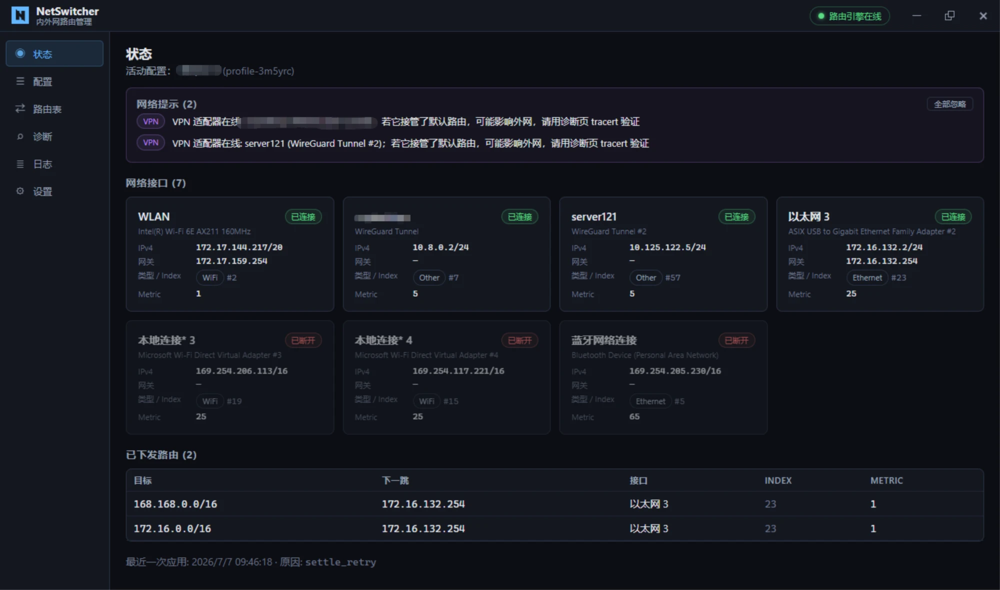
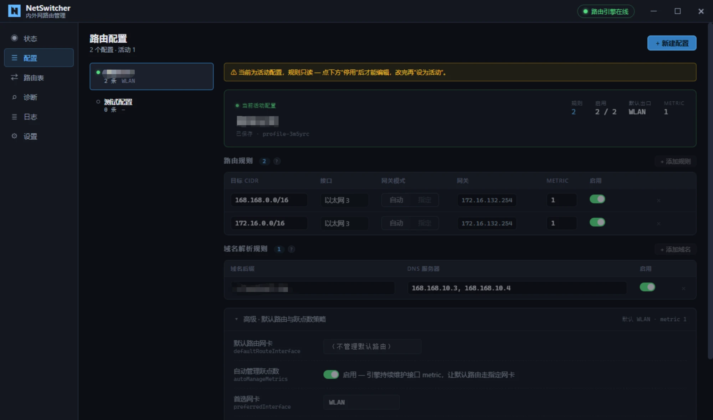

# NetSwitcher

内外网路由管理工具 —— 让 Windows 双网卡（内网以太网 + 外网 Wi-Fi）按网段自动分流，并常驻维护。

> 实现规格见 `docs/NetSwitcher-技术方案.md`，使用说明见 `docs/USER-MANUAL.md`。
> 注意：当前架构与方案文档的"Windows 服务 + IPC"不同（已演化为"GUI 内嵌引擎 + 托盘"），见下文。

## 解决什么问题

机器同时连着内网（以太网，无 Internet）和外网（Wi-Fi，有 Internet）时，让指定网段（如 `168.168.0.0/16` 内网、`172.16.0.0/16` 终端）走以太网，其余流量（含默认路由）走 Wi-Fi。手动 `route -p` 在 Wi-Fi 重连、网卡 index 变化、DHCP 续约后经常失效；NetSwitcher 用一个常驻 GUI 进程监听网络变化、自动重新下发 runtime 路由（**绝不带 `-p`**）。

## 架构（当前）

```
NetSwitcher.exe（提权运行，单进程）
├── Wails GUI（无边框自绘顶栏 + 系统托盘 + 单实例锁）
├── core 路由引擎（直接在进程内，调 route.exe / netsh）
├── netwatch（2s 轮询，网络变化自动 1500ms 去抖重下发）
├── Job Object（父进程退出，所有子进程 webview2/route/ping 一起回收）
└── 任务计划（可选，登录时自动以管理员启动，免 UAC）
```

- **没有 Windows 服务**：路由引擎跑在 GUI 进程里，GUI 关闭（X → 缩托盘）后进程仍存活继续维护路由；从托盘"退出"才结束。
- **路由修改需要管理员权限**：GUI 必须提权运行。首次启动检测到非提权会弹"以管理员身份重启"；建议设置"开机自启"（任务计划"最高权限"，登录自动提权，免每次 UAC）。
- **代价**：只在你登录之后维护路由（登录界面 / 注销时不工作）—— 对个人台式机一般无所谓。

## 构建

依赖：**Go 1.22+**、**Node.js 18+**、**MinGW-w64 (gcc)**（CGO，链接 WebView2）。

```bash
make build          # npm build + CGO go build → NetSwitcher.exe（~18MB，含 GUI）
make build-cli      # 仅服务/CLI（CGO_ENABLED=0，无需 gcc，无 GUI）
make test           # 单测（含 -race）
make icon           # 从 build/windows/icon.ico 重新生成 resource.syso（换图标后跑）
```

Windows PowerShell：`.\build.ps1`（完整）或 `.\build.ps1 -CliOnly`。

> **构建要点**（坑都踩过，记在 `.claude` 项目记忆里）：
> - GUI 必须带 `-tags desktop,production`，否则 Wails 运行时弹"missing build tags"错误框。
> - 必须带 `-ldflags "-H windowsgui"`，否则双击弹黑控制台。
> - `wails generate` / `wails build` 在某些 MinGW 工具链下其临时 `wailsbindings.exe` 会被 Windows 加载器拒绝；`frontend/wailsjs/` 是**手写并提交**的，`make build` 直接走 `go build`，不依赖 `wails` CLI。
> - exe 图标通过 `rsrc` 把 `build/windows/icon.ico` 编进 `cmd/netswitcher/resource.syso`（`make icon` 重生成）。

## 使用

### 双击启动（推荐）

1. 双击 `NetSwitcher.exe` → 打开 GUI。
2. 首次：检测到未提权 → 弹"以管理员身份重启"→ 点同意 → UAC → 提权重启 → 全功能可用。
3. 进"设置"页 → 开"开机自启"→ 之后登录自动以管理员启动，免 UAC。
4. 在"配置"页加规则（目标 CIDR + 接口 + 网关）→ 保存 → 设为活动。
5. 关窗口（✕）→ 缩到系统托盘，进程继续维护路由；托盘右键"退出"才真正结束。

### 命令行（调试/高级）

```
NetSwitcher.exe                       # 打开 GUI（双击等同）
NetSwitcher.exe gui                   # 同上
NetSwitcher.exe apply [--dry-run]     # 读 config 应用一次后退出
NetSwitcher.exe dump                  # 打印接口/配置（调试）
NetSwitcher.exe ipc call <method> [json]   # 命名管道自测（隐藏，遗留）
NetSwitcher.exe service install|uninstall  # 遗留：旧的服务模式（kardianos），GUI 不再使用
NetSwitcher.exe --help
```

> 从 cmd / PowerShell 跑 CLI 命令时输出正常显示；从 Git Bash（mintty）跑看不到输出（AttachConsole 接不上伪终端）。

## 数据目录

`%ProgramData%\NetSwitcher\`：`config.json`（配置）、`state.json`（上次下发的路由）、`logs\netswitcher.log`（按天滚动，保留 7 天）。

## 截图

**状态页** — 接口卡片、已下发路由、冲突告警：



**配置页** — 路由规则、域名解析规则、高级设置：



## 页面

| 页 | 功能 |
|---|---|
| 状态 | 接口卡片（up/down、IPv4、网关、类型）、已下发路由表、"立即重新应用"、冲突告警（VPN/外部覆盖）、跳过/错误列表 |
| 配置 | profile 列表 + 规则表编辑（CIDR / 接口下拉 / 网关 / metric / 启用）、默认路由网卡、metric 策略、字段级校验 |
| 路由表 | `Get-NetRoute` 全表，按来源着色（🟢本工具 / 🟣疑似VPN / ⚪系统），可搜索 |
| 诊断 | ping / tracert 流式输出，可停止 |
| 日志 | 实时日志流 + 级别筛选 + 关键词过滤 |
| 设置 | 开机自启开关、日志级别（运行时切换 + 持久化）、重新应用、打开日志目录、版本/路径 |

## 常见问题：路由没生效怎么排查

1. **提权了吗？** 顶栏药丸应显示"管理员·引擎在线"。否则设置页或弹窗走"以管理员身份重启"。
2. **规则被跳过？** 状态页底部"跳过的规则"写明原因（接口未连接、无网关）—— 网卡连上后自动重试。
3. **冲突？** 状态页顶部标出 VPN 适配器 / 外部覆盖（本工具不主动覆盖 VPN）。
4. **实际走哪？** 诊断页 `tracert <目标>` 看第一跳。
5. **看日志**：日志页实时滚动，或 `%ProgramData%\NetSwitcher\logs\netswitcher.log`。每条 apply 记录 `reason`（startup / network_change / config_change / gui）。

## 测试

`go test -race ./...` 覆盖配置校验、接口名匹配、路由 diff/apply、网络变化检测、去抖、IPC 协议、日志扇出、服务配置。VM 双网卡集成测试矩阵见方案 §13.2。

## 已知边界

- 仅 Windows 10/11 x64（用 WebView2；Win10 需装运行时，Win11 自带）。
- 仅 IPv4（IPv6 字段预留但不处理）。
- 不与 VPN 客户端深度集成（只检测冲突、告警）。
- 嵌入式架构只在用户登录后维护路由（登录前 / 注销时不工作）。

## 许可

MIT — 随意使用、修改、分发（含商用），保留版权声明即可。详见 [LICENSE](LICENSE)。
